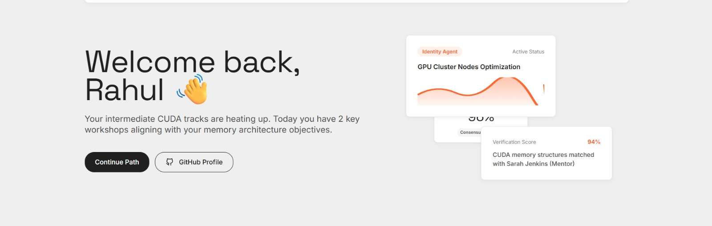
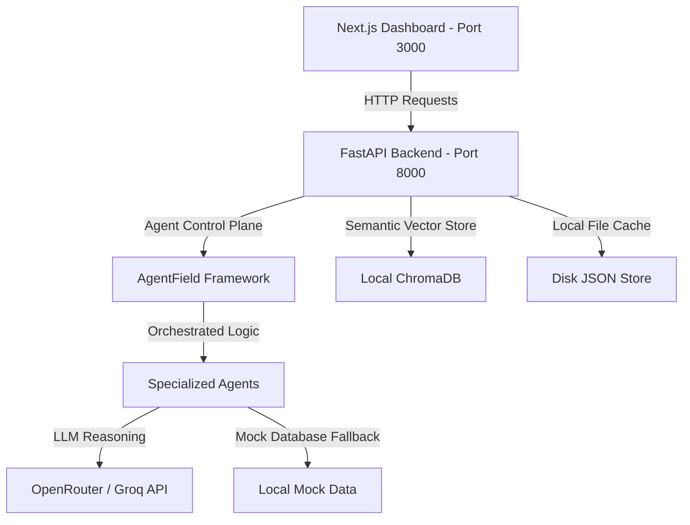

# CommunityOS — Adaptive AI Community Platform


> **AI-Powered Community Operations Agent**
> 
> *Instead of one static chatbot, CommunityOS deploys a team of specialized AI agents to continuously personalize every member's experience while giving community organizers actionable operational intelligence.*

---

## 🌟 The Vision

Traditional communities are static: everyone receives the same welcome, channels, notifications, resources, and event suggestions regardless of background, confidence level, or expertise.

**CommunityOS introduces an intelligent operating layer.** By observing member messages, code queries, and interactions, specialized AI agents customize each member's space dynamically:
- **For Members**: Hyper-personalized welcome roadmaps, custom-matched mentors, and context-aware resource discovery.
- **For Organizers**: Actionable community operations metrics, churn-risk alerts, automated welcome triggers, and AI-suggested events.

---

## 🛠️ Architecture & Tech Stack



- **Frontend**: Next.js 15+ (App Router), React 19, TypeScript, Tailwind CSS, Lucide Icons.
- **Backend**: FastAPI, Uvicorn, Python 3.10+, SQLAlchemy (local SQLite), Pydantic v2.
- **Vector Database**: Local ChromaDB (`backend/data/chroma_db`) for semantic memory.
- **AI Framework**: `agentfield` SDK.
- **Model Providers**: Groq (`llama-3.3-70b-versatile` or `llama3-8b-8192`) & OpenRouter (`openai/gpt-oss-20b:free` or `meta-llama/llama-3.3-70b-instruct:free`).

---

## 🤖 The Multi-Agent Network

Each user persona experiences a dynamically adjusted environment driven by six collaborating agents under the coordination of the [Orchestrator](file:///home/satyansh/communeos/backend/services/orchestrator.py):

```
  Identity Agent  👉  Discovery Agent  👉  Learning Agent  👉  Mentor Agent
 (Analyzes profile)   (Matches channels)    (Creates roadmap)   (Matches expert)
                                  👇
                         Community Health Agent
                          (Detects churn & gap)
                                  👇
                            Organizer Agent
                        (Generates action list)
```

1. **Identity Agent** ([identity_agent.py](file:///home/satyansh/communeos/backend/agents/identity_agent.py)): Examines bios, message logs, and profile tags. Detects skill confidence (Beginner, Intermediate, Advanced, Expert), technical stacks, and preferred learning styles.
2. **Discovery Agent** ([discovery_agent.py](file:///home/satyansh/communeos/backend/agents/discovery_agent.py)): Filters community channels, suggests curated study guides, and schedules relevant upcoming events.
3. **Learning Agent** ([learning_agent.py](file:///home/satyansh/communeos/backend/agents/learning_agent.py)): Designs a customized multi-week milestone learning roadmap and constructs daily priority checklists.
4. **Mentor Agent** ([mentor_agent.py](file:///home/satyansh/communeos/backend/agents/mentor_agent.py)): Queries the mentor directory via vector similarity search, performs matching alignment calculations, and provides explicit match reasonings.
5. **Community Health Agent** ([health_agent.py](file:///home/satyansh/communeos/backend/agents/health_agent.py)): Evaluates community activity logs to identify unanswered onboarding threads, ignored newcomers, and inactive members at risk of churning.
6. **Organizer Agent** ([organizer_agent.py](file:///home/satyansh/communeos/backend/agents/organizer_agent.py)): Synthesizes health signals into a backlog of actionable operational tasks, events, and mentor promotions for community managers.
7. **Memory Agent** ([memory_agent.py](file:///home/satyansh/communeos/backend/agents/memory_agent.py)): Acts as the semantic index router, querying both user memory (resume chunks) and community catalogs from ChromaDB to inject context into reasoning runs.

---

## 🎮 Interactive Demo Scenarios

The interactive dashboard enables organizers and judges to swap between three distinct perspectives:

### 1. Rahul (Intermediate Systems & GPU Enthusiast)
- **Dashboard Adjustments**: Recommended channels focus on `#gpu-computing` and `#systems-programming` (social rooms are deprioritized).
- **Priorities**: CUDA Roadmap completion, matrix multiplication optimizations, and helping beginner Aman.
- **Mentor**: Sarah Chen (Senior GPU Engineer @ NVIDIA).
- **AI Reasoning**: Demonstrates how agents detected his CUDA shared memory questions, matched him with Sarah, and filtered low-level GPU manuals.

### 2. Priya (Beginner AI & Deep Learning Learner)
- **Dashboard Adjustments**: Recommended channels focus on `#pytorch-study-group` and `#machine-learning-basics`. 
- **Priorities**: Completing PyTorch MNIST classifier tutorials and posting her first introduction.
- **Mentor**: Elena Vasquez (Machine Learning Researcher @ DeepMind).
- **AI Reasoning**: Shows agents routing her to beginner notebooks instead of advanced GPU architectures because she is a newcomer with a non-CS background.

### 3. Organizer (Operations & Automation Hub)
- **Dashboard Adjustments**: Switches the dashboard into an operational command center.
- **Metrics**: Active members ratio, unanswered threads, weekly messages, and trending discussion topics.
- **Action Hub**: Features options to trigger automated moderation steps (e.g., welcoming Priya, promoting Rahul to a mentor, or sending re-engagement check-ins to Vikram).

---

## 📂 Repository Map

Below is the directory map of the CommunityOS workspace:

```
communeos/
├── backend/
│   ├── agents/                   # Stateless AI agent implementations
│   │   ├── base_agent.py         # Abstract base agent with caching & timing
│   │   ├── identity_agent.py     # Parses bio & detects skill levels
│   │   ├── discovery_agent.py    # Matches channels, events & resources
│   │   ├── learning_agent.py     # Generates milestones & checklists
│   │   ├── mentor_agent.py       # Scores & matches expert mentors
│   │   ├── health_agent.py       # Identifies ignored posts & inactive members
│   │   ├── organizer_agent.py    # Generates moderator action tasks
│   │   └── memory_agent.py       # ChromaDB vector query coordinator
│   │
│   ├── api/                      # FastAPI HTTP router layer
│   │   ├── v1/
│   │   │   ├── endpoints/
│   │   │   │   ├── auth.py       # JWT creation, login/registration
│   │   │   │   ├── users.py      # CRUD profiles & resume uploads
│   │   │   │   ├── agents.py     # Personalization control plane
│   │   │   │   ├── community.py  # Health analysis triggering
│   │   │   │   └── compat.py     # Consolidated shims for frontend UI
│   │   │   └── dependencies.py   # Token validation & headers
│   │   └── errors.py             # Global exception handlers
│   │
│   ├── data/                     # Local file database & caches
│   │   ├── chroma_db/            # Persistent local Chroma vector database
│   │   ├── users.json            # Local user profile storage
│   │   └── tokens.json           # Session database for local token auth
│   │
│   ├── services/                 # Business logic & external systems
│   │   ├── llm_service.py        # LLM interface & JSON repair helpers
│   │   ├── vector_db.py          # Embedding storage, querying & seeding
│   │   ├── resume_service.py     # PDF text extraction & resume parsing
│   │   ├── orchestrator.py       # Multi-agent workflow coordination
│   │   ├── cache_service.py      # High-performance memory caches
│   │   └── supabase_service.py   # Optional Supabase synchronization
│   │
│   ├── tests/                    # Robustness & validation test suite
│   │   ├── test_agents.py        # Individual agent unit tests
│   │   ├── test_phase1.py        # Auth & DB integration tests
│   │   └── load_test.py          # API concurrency verification
│   │
│   ├── config.py                 # Global environment & fallback configuration
│   └── main.py                   # FastAPI server entry point
│
├── frontend/
│   ├── app/
│   │   ├── page.tsx              # Combined dashboard interface & auth layouts
│   │   ├── layout.tsx            # Main layout wrapper & metadata
│   │   └── globals.css           # Global Tailwind custom overrides
│   ├── lib/                      # Helper libraries & request utilities
│   └── types/                    # Frontend TypeScript type declarations
│
├── images/                       # UI screenshots & diagram assets
├── DESIGN.md                     # Ventriloc design guidelines & styling reference
├── CHANGELOG.md                  # Comprehensive migration & update history
├── roadmap.md                    # Core architecture goals & milestones
└── requirements.txt              # Backend python dependencies
```

---

## ⚡ Key Workflows & Pipelines

### 1. Resume Ingestion & PDF RAG Pipeline
When a user uploads a PDF resume during onboarding:
1. **Extraction**: FastAPI receives the file and invokes [resume_service.py](file:///home/satyansh/communeos/backend/services/resume_service.py), using **PyMuPDF** (`fitz`) to extract raw text pages.
2. **Structuring**: A specialized resume-parsing prompt runs on the LLM to structure the skills, experience, projects, and goals into a clean JSON schema.
3. **Keyword Fallback**: If the LLM is rate-limited or offline, an intelligent local keyword scanner searches the text for 30+ developer keywords and assigns these as the profile skills.
4. **Vector Storage**: The parsed profile is split into five semantic chunks (`Education`, `Projects`, `Skills`, `Experience`, `Career Goals`). These are embedded and stored under the user's vector index in **ChromaDB**.

### 2. Multi-Agent Personalization Loop
1. **Query**: The [Memory Agent](file:///home/satyansh/communeos/backend/agents/memory_agent.py) executes cosine-similarity vector lookups on ChromaDB to pull matching community resources (channels, guides, events) relative to the member's profile goals.
2. **Prompt Assembly**: The [Orchestrator](file:///home/satyansh/communeos/backend/services/orchestrator.py) merges the RAG contexts with the user's profile database.
3. **Execution**: The specialized agents execute (or run via the unified pipeline) to structure recommendations.
4. **Caching & Formatting**: The outputs are cached locally via the [CacheService](file:///home/satyansh/communeos/backend/services/cache_service.py) (1-hour TTL) and mapped through [compat.py](file:///home/satyansh/communeos/backend/api/v1/endpoints/compat.py) into the exact JSON format required by the Next.js UI.

---

## 🎨 Design System: "Ventriloc" Style Guide

The frontend features a clean, premium, and professional light-themed interface centered around the **Ventriloc Design Tokens** ([DESIGN.md](file:///home/satyansh/communeos/DESIGN.md)):

*   **Colors**:
    *   `Mist` Canvas (`#efefef`) — The dominant warm-gray background framing page layouts.
    *   `Paper` (`#ffffff`) — Pure white cards and panels creating a layered layout.
    *   `Signal Orange` (`#ff682c`) — Muted data accents, area charts, active indicators, and logo marks.
    *   `Carbon` (`#202020`) — Text, dark pill button backgrounds, and strong borders.
*   **Typography**:
    *   `Space Grotesk` / `DM Sans` (substitute for PolySans) — Used for headers with a tight line-height (`0.91`) for a modern, architectural structure.
    *   `Inter` — Primary typeface for body text, button labels, grid cards, and navigation links.
*   **Shapes**: Soft `8px` border-radii for preview cards and inputs; full `20px` pill styling for active action buttons and tags.

---

## 🔒 API Endpoints & Routes

### Authentication
*   `POST /api/auth/register` — Register a user locally using password hashing.
*   `POST /api/auth/login-json` — Validate user credentials and issue a session token (`tok_...`).
*   `GET /api/auth/me` — Retrieve details of the authenticated user session.
*   `PUT /api/auth/me` — Update logged-in user profile attributes.

### Users
*   `POST /api/v1/users/create` — Instantly provision basic user profiles.
*   `POST /api/v1/users/{user_id}/onboard` — Form upload endpoint processing user profile fields alongside a PDF resume.
*   `GET /api/v1/users/{user_id}/profile` — Fetch a user's cached personalization recommendations.

### Agents Control
*   `POST /api/v1/agents/personalize/{user_id}` — Trigger the multi-agent pipeline run manually.
*   `GET /api/v1/agents/status/{user_id}` — Query the real-time execution progress of the agent pipeline.

### Compatibility (Frontend-Optimized)
*   `GET /api/members/{user_id}` — Consolidated profile recommendations.
*   `GET /api/organizer` — Health metrics, trending topics, risk warnings, and moderator action lists.

---

## 🧪 Testing & Validation Suite

CommunityOS is backed by a robust test suite located in [backend/tests/](file:///home/satyansh/communeos/backend/tests/) validating agent execution integrity, schema alignment, and backend authentication:

- **Mock-Override Isolation**: Automatically patches LLM services to skip external network calls, executing test suites completely offline against pre-cached mock structures in less than **230 milliseconds**.
- **Agent Unit Tests**: Validates successes and fallback loops for all six specialized agents.
- **Integration Tests**: Creates temporary SQLite instances (`test_communityos.db`) to verify JWT validation constraints, registration blocks, and profile routing parameters.

### Running Tests
To run the full suite:
```bash
pytest backend/tests --ignore=backend/tests/load_test.py
```

To run Phase 1 database/auth integration tests:
```bash
python3 -m unittest backend.test_phase1
```

---

## 🚀 Installation & Local Setup

Ensure you have Python 3.10+ and Node.js 18+ installed on your local machine.

### 1. Repository Setup & Dependencies
Clone the repository and install the backend libraries:
```bash
pip3 install -r requirements.txt
```

Navigate to the frontend directory and install client packages:
```bash
cd frontend
npm install
```

### 2. Environment Configuration
Create a `.env` file in the root workspace folder to enable live LLM operations. If omitted, the system seamlessly falls back to local vector matching and offline mock structures:
```env
# Optional Live API Keys
GROQ_API_KEY="your_groq_api_key"
OPENROUTER_API_KEY="your_openrouter_api_key"

# Database Configuration (Optional)
SUPABASE_URL=""
SUPABASE_ANON_KEY=""
```

### 3. Running the Backend
From the root workspace directory, launch the FastAPI server:
```bash
python3 -m backend.main
```
The FastAPI instance will listen on `http://localhost:8000`. You can inspect the Swagger interactive docs at `http://localhost:8000/docs`.

### 4. Running the Frontend
In a new terminal window, start the Next.js development server:
```bash
cd frontend
npm run dev
```
The web dashboard application will be active at `http://localhost:3000`. Log in using any of the pre-seeded accounts (`rahul` or `priya`) with the password `password`.

---

## 📅 Architecture Roadmap

CommunityOS is scheduled to expand from its synchronous pipeline prototype into a production SaaS application:
1. **Event-Driven Architecture**: Transition pipeline executions into background events utilizing **Celery** workers and a **Redis** event bus.
2. **Real-time Synchronizations**: Integrate **Supabase Realtime** listeners to update client dashboards automatically as agents complete workflows in the background.
3. **Database Memory Scaling**: Leverage PostgreSQL `pgvector` index structures within Supabase to perform advanced semantic matching over thousands of concurrent member profiles.
4. **Blob Storage**: Securely store raw resumes and uploaded developer artifacts using Supabase Storage buckets.
