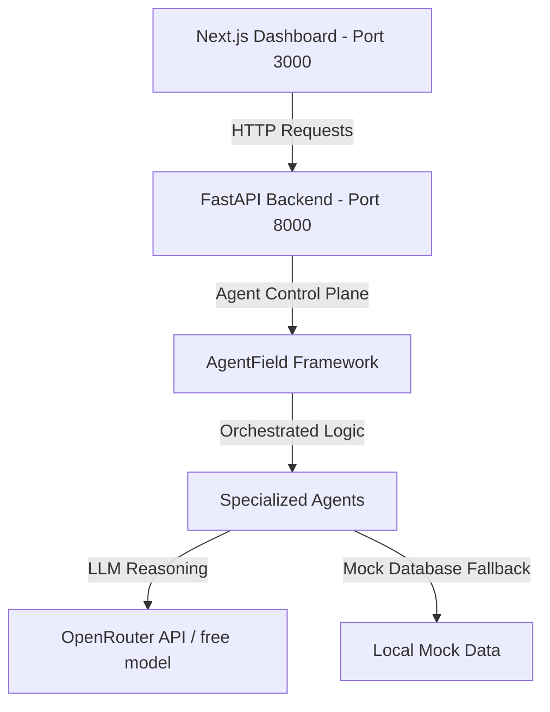

# CommunityOS --- Adaptive AI Community Platform


> **Hackathon Track 2: AI-Powered Community Operations Agent**
> 
> *Instead of one static chatbot, CommunityOS deploys a team of specialized AI agents to continuously personalize every member's experience while giving community organizers actionable operational intelligence.*

---

## 🌟 The Vision

Traditional communities are static: everyone receives the same welcome, channels, notifications, resources, and event suggestions. 

**CommunityOS introduces an intelligent operating layer.** By observing member messages, code queries, and interactions, specialized AI agents customize each member's space dynamically:
- **For Members**: Hyper-personalized welcome roadmaps, custom-matched mentors, and context-aware resource discovery.
- **For Organizers**: Actionable community operations metrics, churn-risk alerts, automated welcome triggers, and AI-suggested events.

---

## 🛠️ Architecture & Tech Stack



*   **Frontend**: Next.js 16 (App Router), React 19, TypeScript, Tailwind CSS v4, Lucide Icons.
*   **Backend**: FastAPI, Uvicorn, Python 3.10.
*   **AI Framework**: `agentfield` SDK.
*   **Model Provider**: OpenRouter (`meta-llama/llama-3-8b-instruct:free` or `google/gemma-2-9b-it:free`).

---

## 🤖 The Multi-Agent Network

Each user persona experiences a dynamically adjusted environment driven by six collaborating agents:

```
  Identity Agent  👉  Discovery Agent  👉  Learning Agent  👉  Mentor Agent
 (Analyzes profile)   (Matches channels)    (Creates roadmap)   (Matches expert)
                                  👇
                         Community Health Agent
                          (Detects churn & gap)
                                  👇
                            Organizer Agent
                        (Generates action list)
```

1.  **Identity Agent**: Examines chat histories, bios, and tags. Detects skill confidence (Beginner, Intermediate, Expert), interests (e.g., CUDA, PyTorch), and preferred learning style.
2.  **Discovery Agent**: Filters community channels and suggests resources (e.g. CUDA Optimization guides for Rahul; PyTorch 101 tutorials for Priya).
3.  **Learning Agent**: Creates daily checklist priorities and designs a multi-step milestone roadmap.
4.  **Mentor Agent**: Evaluates expert databases to calculate alignment and suggest one-on-one mentor matches.
5.  **Community Health Agent**: Tracks member inactivity, unanswered posts, and neglected introductions.
6.  **Organizer Agent**: Converts health metrics into actionable operational tasks for community organizers.

---

## 🎮 Interactive Demo Scenarios

The interactive dashboard enables organizers and judges to swap between three distinct perspectives:

### 1. Rahul (Intermediate Systems & GPU Enthusiast)
*   **Dashboard Adjustments**: Recommended channels focus on `#gpu-computing` and `#systems-programming` (social rooms are deprioritized).
*   **Priorities**: CUDA Roadmap completion, matrix multiplication optimizations, and helping beginner Aman.
*   **Mentor**: Sarah (Senior CUDA Engineer @ Nvidia).
*   **Why am I seeing this? (AI Reasoning)**: Demonstrates how the agents detected his CUDA shared memory questions and matched him with Sarah and low-level code manuals.

### 2. Priya (Beginner AI & Deep Learning Learner)
*   **Dashboard Adjustments**: Recommended channels focus on `#pytorch-study-group` and `#machine-learning-basics`. 
*   **Priorities**: Completing PyTorch MNIST classifier tutorials and posting her first introduction.
*   **Mentor**: Elena (Machine Learning Researcher).
*   **Why am I seeing this? (AI Reasoning)**: Shows agents routing her to beginner notebooks instead of advanced GPU architectures because she is a newcomer with a non-CS background.

### 3. Organizer (Operations & Automation Hub)
*   **Dashboard Adjustments**: Switches the dashboard into an operational command center.
*   **Metrics**: Active members ratio, unanswered threads, and trending discussion topics.
*   **Action Hub**: Features buttons to trigger automated moderation steps (e.g., welcoming Priya, promoting Rahul to a mentor, or sending re-engagement check-ins to Vikram).

---

## 🚀 Running the Project

Follow these instructions to start the frontend and backend servers locally:

### Prerequisites
*   Python 3.10+
*   Node.js 18+

### Setup

1.  **Install dependencies**:
    *   **Backend**:
        ```bash
        pip3 install fastapi uvicorn pydantic python-dotenv openai agentfield
        ```
    *   **Frontend**:
        ```bash
        cd frontend
        npm install
        ```

2.  **Model Configuration (Optional)**:
    Create a `.env` file in the root of the workspace if you wish to run live OpenRouter calls. If omitted, the system falls back to pre-cached mock schemas seamlessly.
    ```env
    OPENROUTER_API_KEY="your_openrouter_key"
    ```

3.  **Run the Backend**:
    From the root directory:
    ```bash
    python3 -m backend.main
    ```
    *The API will listen on `http://localhost:8000`.*

4.  **Run the Frontend**:
    In a new terminal window:
    ```bash
    cd frontend
    npm run dev
    ```
    *The web application will serve on `http://localhost:3000`.*
